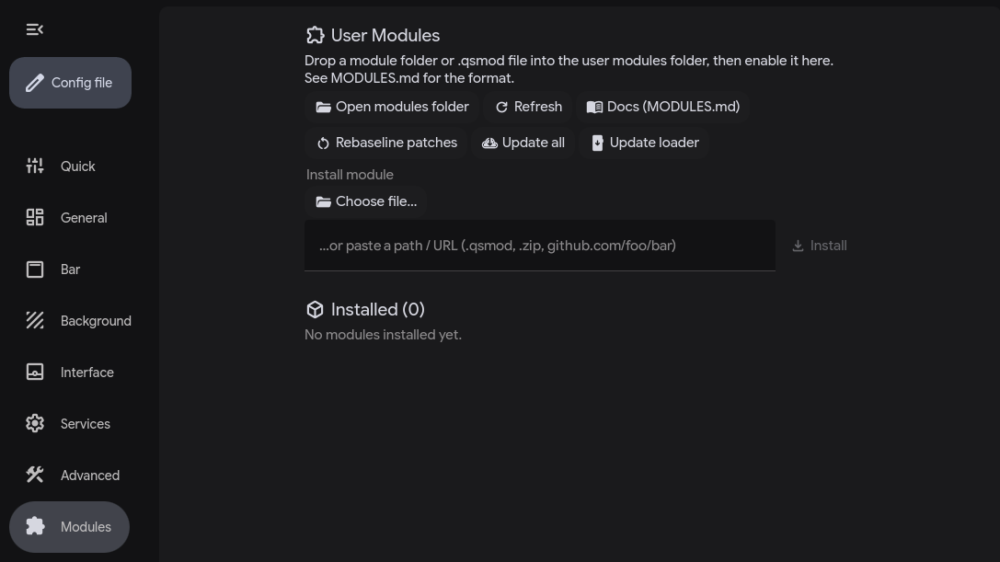

[🇷🇺 Русский](README.md) | [🇬🇧 English](README.en.md)

# Quickshell User Modules — Installer

Adds a user-module system to a quickshell config based on illogical-impulse.



- A new **Settings → Modules** page (enable/disable, install/export, uninstall).
- A `services/UserModules.qml` singleton that scans
  `~/.config/illogical-impulse/user_modules/<id>/`.
- Module manifest fields: `entry` (QML), `barWidgets` (drop into bar),
  `patches` (text-edit existing shell files when toggled).
- `MODULES.md` with the full format spec.
- A few bundled example modules in `defaults/user_modules/`.

## Install

```sh
./install.sh
```

The installer **auto-detects** where the shell lives. It checks, in order:

1. `$QS_DIR` (if you set it)
2. `~/.config/quickshell/ii/` (upstream illogical-impulse layout)
3. `~/.config/quickshell/` (flat layout — files at the root)

Modules dir defaults to `~/.config/illogical-impulse/user_modules`. Override
either explicitly:

```sh
QS_DIR=/path/to/quickshell SHELL_CFG_DIR=/path/to/illogical-impulse ./install.sh
```

Requires: `python3`, `jq`, `bash`. After install, reload quickshell.

The install is idempotent — re-running won't double-patch.

## Uninstall

```sh
./uninstall.sh
```

Reverts all text patches, removes the new files. Your installed modules and
patch originals are preserved (paths printed at the end).

## What changes

New files (copied):

- `services/UserModules.qml`
- `modules/userModules/UserModulesHost.qml`
- `modules/userModules/UserModulesBarSlot.qml`
- `modules/settings/ModulesConfig.qml`
- `scripts/user_modules/patch.sh`
- `MODULES.md`
- `defaults/user_modules/*` (example modules)

Existing files (text-patched, reversible):

- `shell.qml` — imports `UserModulesHost`
- `settings.qml` — adds the Modules page
- `modules/common/Config.qml` — adds `userModules.enabled`
- `modules/common/Directories.qml` — adds `userModulesDir`
- `modules/ii/bar/BarContent.qml` — adds the `UserModulesBarSlot` (skipped if
  the upstream anchor isn't present, e.g. in a heavy fork)
- `translations/ru_RU.json` — Russian strings for the new UI (other languages
  fall back to English; PRs welcome)

## Self-update from GitHub

The shell has an **Update loader** button (Settings → Modules) that pulls a
fresh installer tarball and re-runs `install.sh`. By default it points at:

```
https://github.com/Rom4ik-12/illogical-impulse-plugins/releases/latest/download/illogical-impulse-plugins.tar.gz
```

To change the source, edit `userModules.loaderUpdateUrl` in
`~/.config/illogical-impulse/config.json`. Three URL shapes are accepted:

- direct `.tar.gz` / `.zip`
- a GitHub repo URL (will be shallow-cloned)
- anything else assumed to be a tar.gz

### Publishing your own fork

This directory is also a ready-to-go GitHub repo:

1. Push it to GitHub.
2. Tag a release: `git tag v1.0.0 && git push --tags`.
3. The included `.github/workflows/release.yml` runs `make dist`, attaches
   the tarball to the release, and the `releases/latest/download/...` URL
   becomes available immediately.

Locally:

```sh
make check    # bash/python syntax
make dist     # build dist/illogical-impulse-plugins.tar.gz
```

## Sharing modules

A module is a folder with `module.json` + entry QML. Zip it as `<id>.qsmod`
(or share the folder). Recipient drops it into their user_modules/ or uses
the **Install** button in Settings → Modules.

See `payload/MODULES.md` for the full format.
